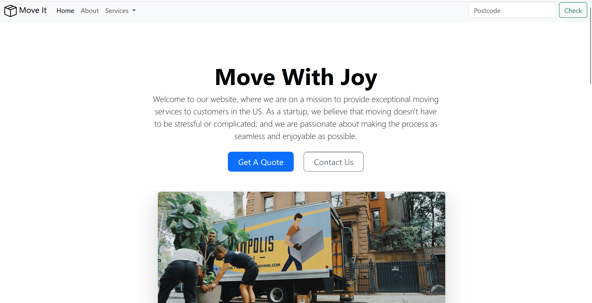
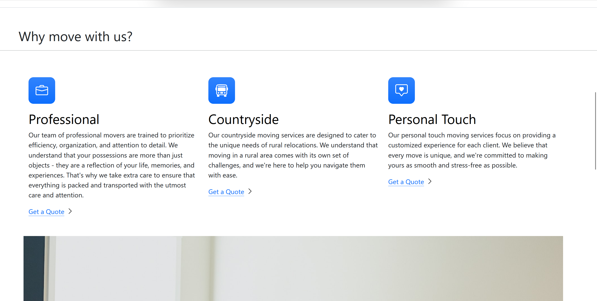

# bootstrap-website
# Move It 🏠📦

**Move It** is a responsive website built for a young startup specializing in **moving and packaging services**. The goal of this project was to consolidate my knowledge of front-end web development using **HTML**, **CSS**, and **Bootstrap**.

## 🔍 Overview

This website provides an engaging and user-friendly interface for customers looking for relocation services. From smooth navigation to visually appealing sections, **Move It** is designed to offer a professional digital presence for a startup.

## 💡 Features

- ✅ Clean and modern design  
- ✅ Responsive layout for mobile, tablet, and desktop  
- ✅ Bootstrap carousel to showcase services or testimonials  
- ✅ Fixed-top navigation bar for easy access to sections  
- ✅ Reusable Bootstrap components to simplify styling  

## 🚀 Technologies Used

- **HTML5**
- **CSS3**
- **Bootstrap 5**

## 🎯 Learning Outcome

This project helped me:

- Reinforce core concepts in HTML and CSS  
- Understand and implement Bootstrap components effectively  
- Practice responsive web design  
- Get hands-on experience structuring and styling a real-world project  

## 📸 Preview

## 📁 Folder Structure
MoveIt/
│
├── index.html
├── css/
│ └── styles.css
├── images/
│ └── (all images used in the site)
└── README.md

## 📌 Future Improvements

- Add contact form with validation  
- Integrate Google Maps API for location-based services  
- Include testimonials section with real customer reviews  

## 🤝 Acknowledgements

Special thanks to [Bootstrap](https://getbootstrap.com/) for their excellent documentation and components that made styling this project efficient and fun.

